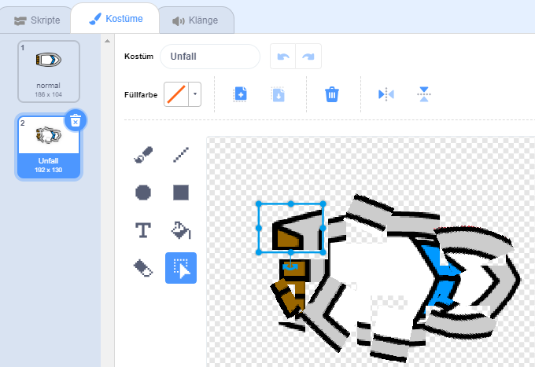

## Einen Unfall bauen!

Im Moment kann dein Boot einfach durch die hölzernen Hindernisse segeln! Reparieren wir das.

\--- task \---

Du wirst zwei Kostüme für dein Boot brauchen, ein normales Kostüm und eins, wenn das Boot einen Unfall hat. Dupliziere dein Bootskostüm "**normal**" und nenne das neue Kostüm "**Unfall**".

\--- /task \---

\--- task \---

Klicke auf das "**Unfall**" -Kostüm und wähle den Befehlen ** Auswählen ** aus, um Teile des Kostüms zu greifen, zu bewegen und zu drehen. Das Boot soll am Ende total kaputt aussehen.



\--- /task \---

\--- task \---

Jetzt füge deinem Boot neuen Code hinzu, so dass es auseinander bricht, sobald es braune Holzteile berührt.

\--- Hinweise \--- \--- Hinweis \--- Du musst dem Code in deiner ` wiederhole fortlaufend ` {: class = "block3control"}-Schleife ergänzen, damit er immer wieder prüft, ob das Boot einen Unfall hat. <0> Falls </0> {: class = "block3control"} das Boot das Braun des Holzes <0> berührt </0> {: class = "block3control"}, musst du <0> zum Unfall-Kostüm wechseln </0> {: class = "block3control"}, <0> Oh nein! sagen für 2 Sekunden </0> {: class = "block3control"} und anschließend wieder <0> zum normalen Kostüm wechseln </0> {: class = "block3control"}. Schließlich musst du <0> die Richtung auf "oben" setzen </0> {: class = "block3control"} und <0> zur Startposition gehen </0> {: class = "block3control"}.

`wenn`{:class="block3control"} das Boot `berührt`{:class="block3sensing"} die braune Farbe des Holzes berührt, musst du `zum Unfall Kostüm wechseln`{:class="block3looks"}, ` und Ohn nein! sagen. für 2 Sekunden`{:class="block3look"}, und anschließend `zurück zum normalen Kostüm wechseln`{:class="block3look"}. Als letztes musst du das Köstum `nach oben`{:class="block3motion"} zeigen lassen und `zur Startposition gehen`{:class="block3motion"}.

\--- /hint \--- \--- hint \--- Hier sind die Codeblöcke die du brauchst: 

```blocks3
falls <touching color [ ] ?> dann
ende

gehe zu x: (-190) y: (-150)

wechsle zu Kostüm (Unfall v)

setze Richtung auf (0) Grad

wechsle zu Kostüm (normal v)

sage [Oh nein!] für (2) Sekunden
```

\--- /hint \--- \--- hint \--- So sollte dein Programmiercode aussehen: 

```blocks3
Wenn grüne Flagge angeklickt wird
setze Richtung auf (0) Grad
gehe zu x: (-190) y: (-150)
wiederhole fortlaufend
wenn <(Entfernung von (Mauszeiger v)) > [5]> dann
drehe dich zu (Mauszeiger v)
gehe (1) er Schritt
ende
wenn <touching color [#663b00] ?> dann
wechsle zu Kostüm (Unfall v)
sage [Oh nein!] für (2) Sekunden
wechsle zu Kostüm (normal v)
setze Richtung auf (0) Grad
geh zu x: (-190) y: (-150)
ende
```

\--- /hint \--- \--- /hints \---

\--- /task \---

\--- task \---

Du solltest auch sicherstellen, dass dein Boot zu Beginn eines Spiels immer "normal" aussieht und somit dieses Kostüm trägt.

Teste deinen Code erneut. Wenn dein Boot nun versucht durch einenhölzerne Barriere zu segeln, sollte das Boot zu dem Unfall Look wechseln, Oh nein! sagen und anschließend zur Startpoition zurückkehren.


\--- /task \---