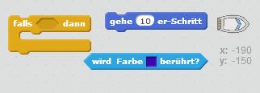

## Hindernisse und Power-ups

Also, dieses Spiel ist *echt* einfach - lass uns Sachen hinzufügen, damit es interessanter wird.

+ Fügen wir erst einige "Boosts" zu deinem Spiel hinzu, um das Boot anzutreiben. Bearbeite deine Bühne und füge einige weißen Boost-Pfeile hinzu.
    
    

+ Jetzt füge Code zu dem "wiederhole fortlaufend" Schleife von deinem Boot, famit es drei zusätzliche Schritte macht, wenn es einen weißen Booster berührt.

\--- hints \--- \--- hint \--- `Falls` dein Boot `einen weißen Booster berührt`, dann sollte es `3 zusätzliche er-Schritte` gehen.  
\--- /hint \--- \--- hint \--- Hier sind die Code-Blöcke, die du brauchen wirst:  \--- /hint \--- \--- hint \--- So sollte dein Code aussehen:  \--- /hint \--- \--- /hints \---

+ Du kannst auch ein drehendes Tor hinzufügen, das dein Boot vermeiden muss. Füge einen neuen Sprite "Tor" hinzu, die so aussieht:
    
    
    
    Achte darauf, dass die Farbe von dem Tor genau dieselbe ist als die von den Holzhindernisse.

+ Bestimme die Mitte von dem Tor-Sprite.
    
    

+ Füge Code zu deinem Tor, damit es sich immer wieder dreht.

\--- hints \--- \--- hint \--- Füge Code zu der Tor-Sprite damit sie `fortlaufend wiederholt`, `sich um 1 Grad zu drehen`. \--- /hint \--- \--- hint \--- Hir sind die Code-Blöcke, die du brauchen wirst:  \--- /hint \--- \--- hint \--- So sollte dein Code aussehen:  \--- /hint \--- \--- /hints \---

+ Teste dein Spiel. Du solltest jetzt ein drehendes Tor haben, das du vermeiden muss.
    
    