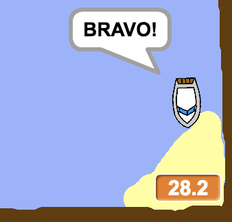

## Ajouter un chronomètre

Tu vas maintenant ajouter une minuterie à ton jeu, de sorte que le joueur doive se rendre sur l'île le plus rapidement possible.

\--- task \---

Ajoute une nouvelle variable appelée `temps`{:class="block3variables"} à ta scène.


[[[generic-scratch3-add-variable]]]

Tu peux également choisir l'apparence de ta minuterie en modifiant le mode d'affichage de ta nouvelle variable.

\--- /task \---

\--- task \---

Ajoute maintenant des blocs de code à ta scène afin que le minuteur compte jusqu'à ce que le bateau atteigne l'île.

\--- hints \--- \--- hint \--- Sur la scène, `lorsque le drapeau vert est cliqué`{:class="block3control"}, `définir l'heure sur 0`{:class="block3variables"}. Dans ta boucle `répéter indéfiniment`{:class="block3control"}, tu dois d'abord attendre `secondes 0,1 secondes`{:class="block3control"}, puis `modifier l'heure de 0,1`{:class="block3variables" }. \--- / hint \--- \--- hint \--- Voici les blocs de code dont tu auras besoin: 

```blocks3
ajouter (0.1) à [temps v]

lorsque le drapeau est cliqué

répéter indéfiniment
fin

attendre (0.1) secondes

mettre [temps v] sur [0]
```

\--- /hint \--- \--- hint \--- Voici à quoi devrait ressembler ton nouveau code: 

```blocks3
lorsque le drapeau est cliqué
mettre [temps v] à [0]
répéter indéfiniment
attendre (0.1) secondes
ajouter (0.1) à [heure v]
fin
```

\--- /hint \--- \--- /hints \---

\--- /task \---

\--- task \---

Teste ton jeu et vois à quel point tu peux arriver rapidement à l'île!



\--- /task \---