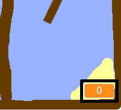

## एक टाइमर जोडत आहे

आता आपण आपल्या गेममध्ये एक टाइमर जोडू शकता जेणेकरून खेळाडूला शक्य तितक्या लवकर बेटाकडे जाणे आवश्यक आहे.

\--- कार्य \---

आपल्या स्टेजवर `वेळ`{: class = "block3variables"} नावाचे एक नवीन चलन जोडा.



[[[generic-scratch3-add-variable]]]

आपण आपले नवीन व्हेरिएबल कसे प्रदर्शित केले आहे ते बदलून आपल्या टायमरची एक नक्कल निवडू शकता.

\--- / कार्य \---

\--- कार्य \---

आता आपल्या स्टेजवर कोड अवरोध जोडा जेणेकरून बेटी बेटावर पोचते तोपर्यंत टाइमर मोजा.

\--- इशारे \--- \--- इशारा \--- रंगमंच, रोजी `हिरवा झेंडा क्लिक केली जाते तेव्हा`{वर्ग = "block3control"}, `0 वेळ`{वर्ग = "block3variables "}. आत आपल्या `कायमचे`{वर्ग = "block3control"} पळवाट, आपण प्रथम करणे आवश्यक आहे `प्रतीक्षा 0.1 से`: {class = "block3control"}, नंतर `0.1 बदल वेळ`{वर्ग = "block3variables" }. \--- / संकेत \--- \--- इशारा \--- येथे आपल्याला आवश्यक असलेले कोड अवरोध आहेत: 

```blocks3
बदला [वेळ v] by (0.1)

जेव्हा ध्वज

कायमचे क्लिक केले
अंत

प्रतीक्षा (0.1) सेकंद

सेट [वेळ v] ते [0]
```

\--- / संकेत \--- \--- इशारा \--- आपला नवीन कोड कसा दिसला पाहिजे ते येथे आहे: 

```blocks3
ध्वज
सेट [वेळ व्ही] ते [0]
क्लिक केले
प्रतिक्षा (0.1) सेकंद
बदल [वेळ व्ही] द्वारे (0.1)
समाप्ती
```

\--- / संकेत \--- \--- / संकेत \---

\--- / कार्य \---

\--- कार्य \---

आपल्या खेळाचे परीक्षण करा आणि आपण बेटावर किती लवकर बोट मिळवू शकता ते पहा!


\--- / कार्य \---