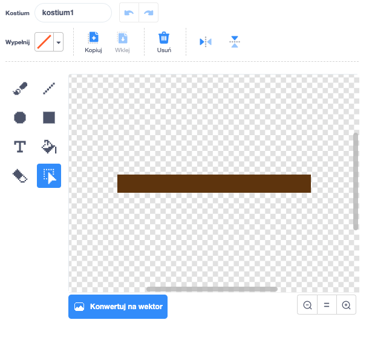

## Przeszkody i boostery

Teraz gra jest **pory** zbyt łatwe, więc można dodać kilka rzeczy, aby uczynić go bardziej interesujące.

Najpierw dodasz kilka boosterów, aby przyspieszyć łódź.

\--- task \---

Edytuj tło sceny, dodając białe strzałki wspomagające.


\--- /task \---

\--- task \---

Teraz dodaj więcej bloków kodu do pętli `zawsze`{: class = "block3control"}, aby duszek łodzi poruszał się o trzy dodatkowe kroki, gdy dotknie białej strzałki. 

```blocks3
jeśli <touching color [#FFFFFF] ?> to
ruch (3) kroki
kończą się
```

\--- /task \---

\--- task \---

Przetestuj grę, aby zobaczyć, czy nowe strzałki przyspieszające przyspieszają łódź.

\--- /task \---

Następnie dodasz obrotową bramę, której łódź musi unikać.

\--- task \---

Dodaj nowego duszka, który wygląda tak, i nazwij go „bramą”:


Upewnij się, że kolor duszka bramy jest taki sam jak kolor drewnianych barier.

\--- /task \---

\--- task \---

Upewnij się, że środek duszka bramy jest ustawiony pośrodku.



\--- /task \---

\--- task \---

Dodaj kod do duszka bramy, aby obracał się powoli na zawsze.

\--- wskazówki \--- \--- wskazówka \--- Dodaj bloki kodu do duszka bramy, aby `zmienił 1 stopień`{: class = "block3motion"} `zawsze`{: class = "block3control"} . \--- / wskazówka \--- \--- wskazówka \--- Oto potrzebne bloki kodu: 

```blocks3
na zawsze
koniec

obróć cw (1) stopnie

po kliknięciu flagi
```

\--- / wskazówka \--- \--- wskazówka \--- Oto jak powinien wyglądać twój nowy kod: 

```blocks3
kiedy flaga kliknęła
zawsze
obrót cw (1) stopnie
koniec
```

\--- /hint \--- \--- /hints \---

\--- /task \---

\--- task \---

Sprawdź swoją grę jeszcze raz. Powinieneś teraz mieć obrotową bramę, którą musisz poruszać łodzią.


\--- /task \---