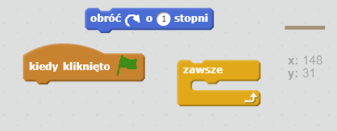

## Przeszkody i dodatki

W tym momencie gra jest *dużo* za łatwa - dodajmy kilka rzeczy, żeby uczynić ją bardziej interesującą.

+ Najpierw dodajmy ‘przyspieszacze’, dzięki którym łódź będzie mogła zwiększyć swoją prędkość. Wyedytuj tło sceny i dodaj kilka białych strzałek.
    
    

+ Teraz dodaj nieco nowego kodu do bloku pętli zawsze łodzi. Dzięki niemu będzie ona przesuwać się o 2 dodatkowe kroki za każdym razem, gdy dotknie białej strzałki.

\--- hints \--- \--- hint \--- `Jeżeli` twoja łódź `dotyka białej strzałki`, powinna wtedy `przejść 2 dodatkowe kroki`.  
\--- /hint \--- \--- hint \--- Tu są bloki kodu które będziesz potrzebował:  \--- /hint \--- \--- hint \--- Tak powinien wyglądać twój kod:  \--- /hint \--- \--- /hints \---

+ Możesz dodać także obrotowe bramy, które Twoja łódź będzie musiała omijać. Dodaj nowego duszka i nazwij go ‘brama’. Twój duszek powinien wyglądać tak:
    
    
    
    Upewnij się, że kolor bramy jest taki sami jak kolor drewnianych barier.

+ Ustaw środek sprite-a bramy.
    
    

+ Dodaj kod, do bramy aby się zawsze powoli obracała.

\--- hints \--- \--- hint \--- Dodaj kod do sprite'a bramy, aby ` zamienił się o 1 stopień ` ` na zawsze `. \--- /hint \--- \--- hint \--- Tu są bloki kodu, które będziesz potrzebował:  \--- /hint \--- \--- hint \--- Tak powinien wyglądać twój kod:  \--- /hint \--- \--- /hints \---

+ Przetestuj swoją grę. Powinieneś teraz mieć wirującą bramę, której musisz unikać.
    
    