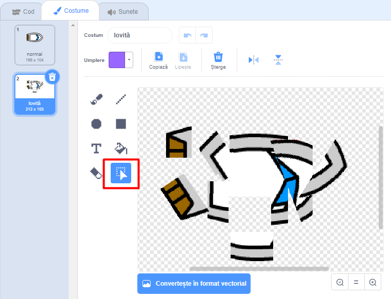

## Accidentele!

În acest moment, barca poate naviga pur și simplu printre barierele de lemn! O sa repari asta acum.

\--- task \---

O să ai nevoie de două costume pentru barca ta: unul normal și unul pentru barca care se lovește de lemne. Dublează costumul bărcii și denumește unul dintre ele „normal” iar celălalt „lovită”.

\--- /task \---

\--- task \---

Dă click pe costumul „lovită” și folosește unealta **Selectează** pentru a prinde bucățile din costum și a le muta și roti pentru a face barca să pară că s-a făcut bucăți.



\--- /task \---

\--- task \---

Acum, adaugă codul la barca ta astfel încât să se lovească și rupă atunci când atinge bucățile maro de lemn.

\--- hints \--- \--- hint \---

You need to add code blocks inside your `forever`{:class="block3control"} loop so that your code keeps checking if the boat sprite has crashed, and if it has crashed, the code needs to reset the boat sprite's position.

`if`{:class="block3control"} the boat is `touching`{:class="block3sensing"} the brown colour of the wood, you need to `switch to the hit costume`{:class="block3looks"}, `say Noooo! for 2 seconds`{:class="block3looks"}, and then `switch back to the normal costume`{:class="block3looks"}. Finally, you'll need to `point up`{:class="block3motion"} and `go to the start position`{:class="block3motion"}.

\--- /hint \--- \--- hint \---

Here are the code blocks you need:


```blocks3
dacă <atinge culoarea []?> atunci
end

mergi la x: (-190) y: (-150)

schimbă costumul la (lovită v)

orientează-te în direcția (0)

schimbă costumul la (normal v)

spune [Nuuuu!] pentru (2) secunde
```

\--- /hint \--- \--- hint \---

Here's what your code should look like:


```blocks3
când se dă click pe stegulețul verde
orientează-te în direcția (0)
mergi la x: (-190) y: (-150)
la infinit
dacă <(distanța până la (cursorul mouse-ului v)) > [5]> atunci
orientează-te spre (cursorul mouse-ului v)
mergi (1) pași
end
dacă <atinge culoarea [#663b00]?> atunci
end
mergi la x: (-190) y: (-150)
schimbă costumul la (lovită v)
orientează-te în direcția (0)
schimbă costumul la (normal v)
spune [Nuuuu!] pentru (2) secunde
schimbă costumul la (normal v)
orientează-te în direcția (0)
mergi la x: (-190) y: (-150)
end
```

\--- /hint \--- \--- /hints \---

\--- /task \---

\--- task \---

You should also add code to make sure that your boat sprite always starts out looking 'normal'.

Test your code again. If you try to sail the boat through a wooden barrier now, the boat should crash and then move back to its starting position.


\--- /task \---