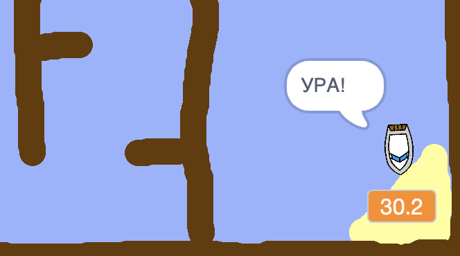

## Додати таймер

Тепер у вашу гру буде додано таймер, щоб гравець якомога швидше дістався до острова.

\--- task \---

Додайте нову змінну, що називається `time`{: class = "block3variables"} на ваш етап.


[[[generic-scratch3-add-variable]]]

Ви також можете вибрати вигляд таймера, змінивши спосіб відображення нової змінної.

\--- /task \---

\--- task \---

Тепер додайте кодові блоки до вашої Stage, щоб таймер підраховував до тих пір, поки човен не досягне острова.

\--- \--- натяки \--- \--- Підказка на сцені, `, коли зелений прапор клацнув`{: клас = "block3control"}, `встановити час до 0`{: клас = "block3variables "}. Всередині вашого `назавжди`{: клас = "block3control"} цикл, вам потрібно спочатку `почекати 0.1 сек`{: клас = "block3control"}, а потім `змінити час на 0,1`{: клас = "block3variables" }. \--- / підказка \--- \--- натяк \--- Тут знаходяться кодові блоки: 

```blocks3
змінити [час v] на (0,1)

коли прапор натиснув

назавжди
кінець

чекати (0,1) секунди

встановити [час від] до [0]
```

\--- / підказка \--- \--- натяк \--- Ось як має виглядати новий код: 

```blocks3
коли прапорець натиснув
встановити [час v] на [0]
назавжди
чекати (0,1) секунди
змінити [час v] на (0,1)
кінець
```

\--- /hint \--- \--- /hints \---

\--- /task \---

\--- task \---

Перевірте свою гру і подивіться, як швидко ви отримаєте човен на острів!



\--- /task \---